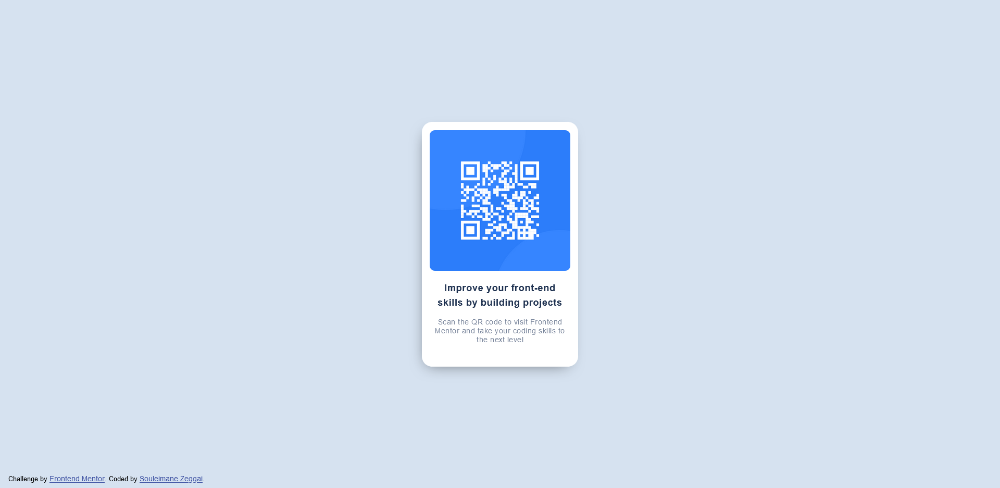

# Frontend Mentor - QR code component solution

This is my solution to the [QR code component challenge on Frontend Mentor](https://www.frontendmentor.io/challenges/qr-code-component-iux_sIO_H). Frontend Mentor challenges help you improve your coding skills by building realistic projects. 

## Table of contents

- [Overview](#overview)
  - [Screenshot](#screenshot)
  - [Links](#links)
- [My process](#my-process)
  - [Built with](#built-with)
- [Author](#author)

**Note: Delete this note and update the table of contents based on what sections you keep.**

## Overview
Premier challenge sur Frontend Mentor, le but était de reproduire une image en HTML & CSS.

### Screenshot

### Links

- Solution URL: [Add solution URL here](https://www.frontendmentor.io/solutions/qr-code-component-Jzf2g4Wlc5)
- Live Site URL: [Demo](https://souleimane-z.github.io/QR-Code_SZ/)

## My process

I created a simple "div" container with the image, a "h1" title and a "p" paragraph.
The rest was created with simple CSS and flexboxes.
To center the card, I used "position: absolute".

### Built with

- Semantic HTML5 markup
- CSS custom properties
- Flexbox

## Author

- Website - [Portfolio Souleimane-z](https://www.souleimane-z.com)
- Frontend Mentor - [@souleimane-z](https://www.frontendmentor.io/profile/souleimane-z)
- LinkedIn - [Souleimane Zeggai](https://www.linkedin.com/in/souleimane-zeggai/)
